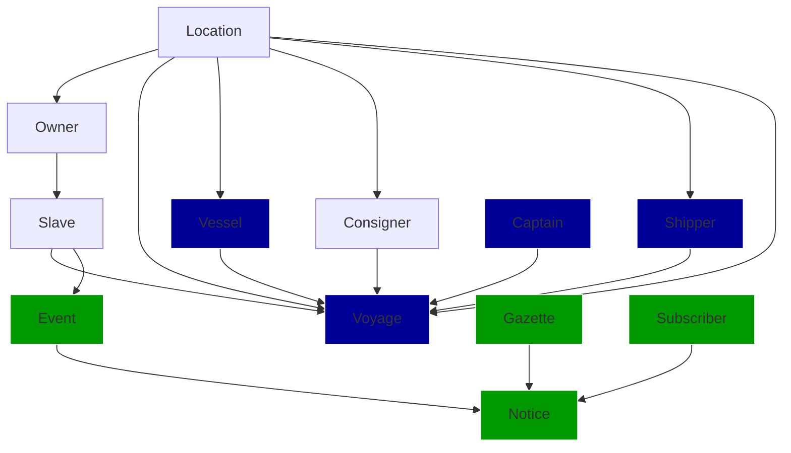

# Slavery manifest and fugitive data

## Data model

## ElasticSearch infrastructure

## Autoencoding Graph Ensemble (AGE)

## Evaluation

After a model is trained, it is evaluated on unseen test data in the following ways: 

  for each field F and instance I, mask I[F] (entity-level field reconstruction)
  for each field F, mask F across all instances (type-level field reconstruction)
  for each edge type (S->T), remove X% of edges, rank potential Ts for P-at-N (edge prediction)
  
